# Assignment 3: Architecture Design (ZYURA)
**Algorand Protocol Architecture**

This document describes the ZYURA architecture on **Algorand**: a single stateful app (TEALScript), box storage, and ASAs; flight data is supplied by a configurable layer (e.g. GitHub-backed store). See the main [README](./README.md) for setup and structure.

**Architecture mapping:**

| Concept | Algorand (Zyura-Algorand) |
|--------|---------------------------|
| Program / state | Single stateful app (TEALScript) |
| Config, products, policies, LPs | App global state + box storage (key-value by id) |
| Token / NFT | Algorand Standard Assets (USDC ASA, policy NFT ASA); inner tx transfers |
| Policy NFT metadata | ARC-3-style policy NFT (ASA + metadata URL); optional off-chain JSON (e.g. GitHub) |
| Flight / delay data | Configurable data layer: flight delay + PNR (demo: GitHub-backed store; prod: oracle/API) |
| Cross-contract calls | Inner transactions (asset transfer, opt-in, etc.) |

---

## Part A: Program Structure Visualization

### 1. Core Program Architecture

The ZYURA protocol on Algorand consists of a single stateful app (TEALScript) that manages all insurance operations through modular logic (initialize, products, policies, liquidity, admin).

```mermaid
graph TB
    subgraph "ZYURA Program"
        ZP["<b>ZYURA App</b><br/>Stateful app (TEALScript)"]
        
        subgraph "Instruction Modules"
            INIT["<b>Initialize</b>"]
            PROD["<b>Product Management</b>"]
            POLICY["<b>Policy Operations</b>"]
            LIQ["<b>Liquidity Management</b>"]
            ADMIN["<b>Admin Controls</b>"]
        end
        
        ZP --> INIT
        ZP --> PROD
        ZP --> POLICY
        ZP --> LIQ
        ZP --> ADMIN
    end
    
    subgraph "Algorand Primitives"
        ASA["<b>Algorand Standard Assets</b>"]
        VAULT_ASA["<b>USDC / Vault ASA</b>"]
        NFT_ASA["<b>Policy NFT (ARC-3)</b>"]
        DATA["<b>Flight Data Layer</b>"]
    end
    
    ZP -.Inner Tx.-> ASA
    ZP -.Inner Tx.-> VAULT_ASA
    ZP -.Inner Tx.-> NFT_ASA
    ZP -.Reads.-> DATA
    
    style ZP fill:#667eea,stroke:#4c51bf,stroke-width:4px,color:#fff
    style INIT fill:#4299e1,stroke:#2b6cb0,stroke-width:2px,color:#fff
    style PROD fill:#48bb78,stroke:#2f855a,stroke-width:2px,color:#fff
    style POLICY fill:#ed8936,stroke:#c05621,stroke-width:2px,color:#fff
    style LIQ fill:#38b2ac,stroke:#2c7a7b,stroke-width:2px,color:#fff
    style ADMIN fill:#9f7aea,stroke:#805ad5,stroke-width:2px,color:#fff
    style ASA fill:#f6ad55,stroke:#dd6b20,stroke-width:2px,color:#1a202c
    style VAULT_ASA fill:#fc8181,stroke:#e53e3e,stroke-width:2px,color:#fff
    style NFT_ASA fill:#68d391,stroke:#38a169,stroke-width:2px,color:#1a202c
    style DATA fill:#b794f4,stroke:#9f7aea,stroke-width:2px,color:#fff
```

### 2. Instruction Flow Diagram

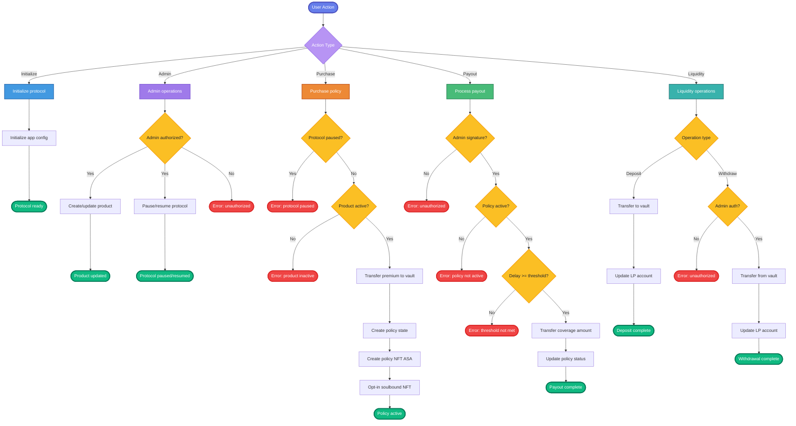

---

## Part B: Account Structure Mapping

### 1. Account Hierarchy and Ownership

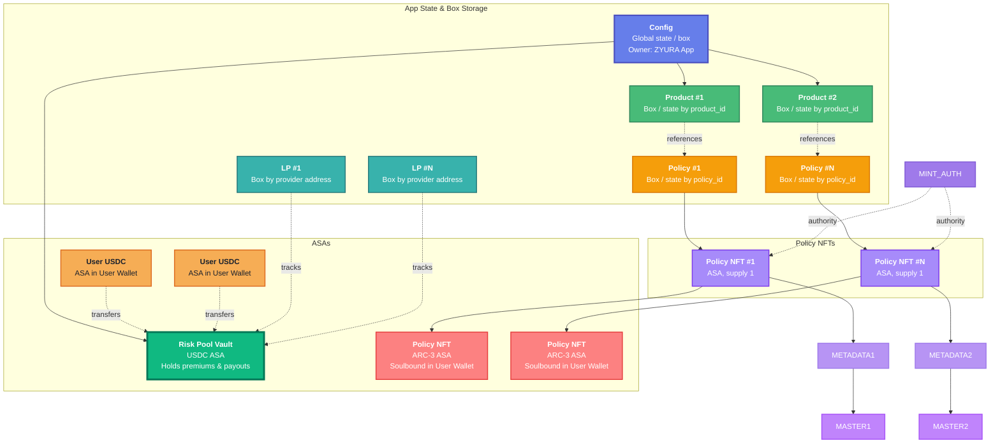

### 2. Account Data Structures

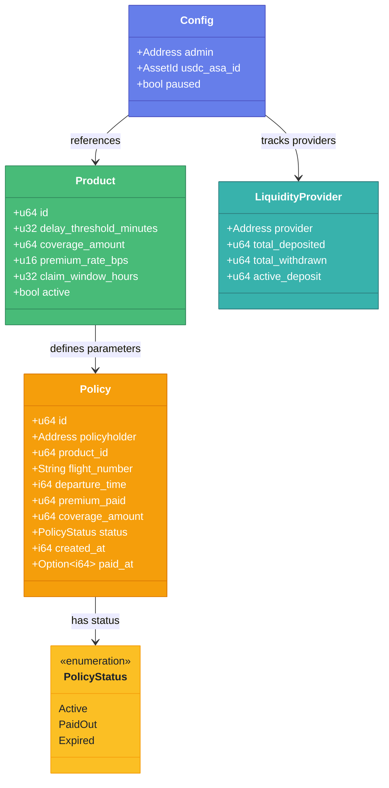

### 3. App State & Box Derivation

```mermaid
flowchart LR
    subgraph "Config"
        C1["App global state"] --> C2["App ID"] --> C3["<b>Config</b><br/>admin, usdc_asa_id, paused"]
    end
    
    subgraph "Product"
        P1["Box key"] --> P2["Product ID: u64"] --> P3["App ID"] --> P4["<b>Product box</b><br/>params, active"]
    end
    
    subgraph "Policy"
        POL1["Box key"] --> POL2["Policy ID: u64"] --> POL3["App ID"] --> POL4["<b>Policy box</b><br/>policyholder, flight, status"]
    end
    
    subgraph "LP"
        LP1_SEED["Box key"] --> LP2["Provider Address"] --> LP3["App ID"] --> LP4["<b>LP box</b><br/>deposits, active_deposit"]
    end
    
    style C1 fill:#4299e1,stroke:#2b6cb0,stroke-width:2px,color:#fff
    style C2 fill:#4299e1,stroke:#2b6cb0,stroke-width:2px,color:#fff
    style C3 fill:#667eea,stroke:#4c51bf,stroke-width:3px,color:#fff
    style P1 fill:#68d391,stroke:#38a169,stroke-width:2px,color:#1a202c
    style P2 fill:#68d391,stroke:#38a169,stroke-width:2px,color:#1a202c
    style P3 fill:#68d391,stroke:#38a169,stroke-width:2px,color:#1a202c
    style P4 fill:#48bb78,stroke:#2f855a,stroke-width:3px,color:#fff
    style POL1 fill:#f6ad55,stroke:#dd6b20,stroke-width:2px,color:#1a202c
    style POL2 fill:#f6ad55,stroke:#dd6b20,stroke-width:2px,color:#1a202c
    style POL3 fill:#f6ad55,stroke:#dd6b20,stroke-width:2px,color:#1a202c
    style POL4 fill:#f59e0b,stroke:#d97706,stroke-width:3px,color:#fff
    style LP1_SEED fill:#7dd3fc,stroke:#0ea5e9,stroke-width:2px,color:#1a202c
    style LP2 fill:#7dd3fc,stroke:#0ea5e9,stroke-width:2px,color:#1a202c
    style LP3 fill:#7dd3fc,stroke:#0ea5e9,stroke-width:2px,color:#1a202c
    style LP4 fill:#38b2ac,stroke:#2c7a7b,stroke-width:3px,color:#fff
```

---

## Part C: External Dependencies and Integrations

### 1. External System Integration

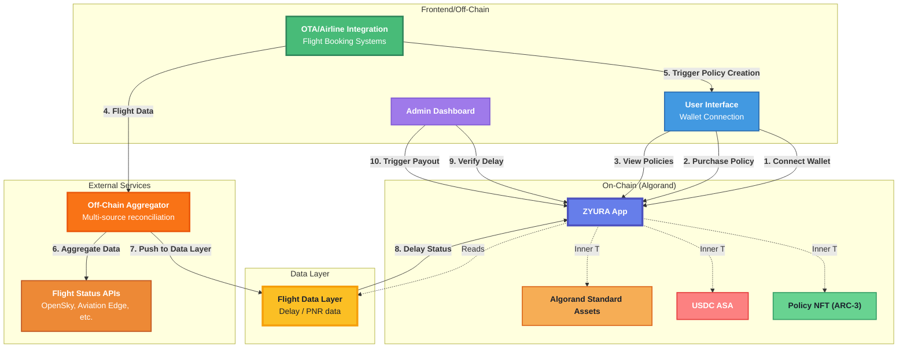

### 2. Flight Data Flow

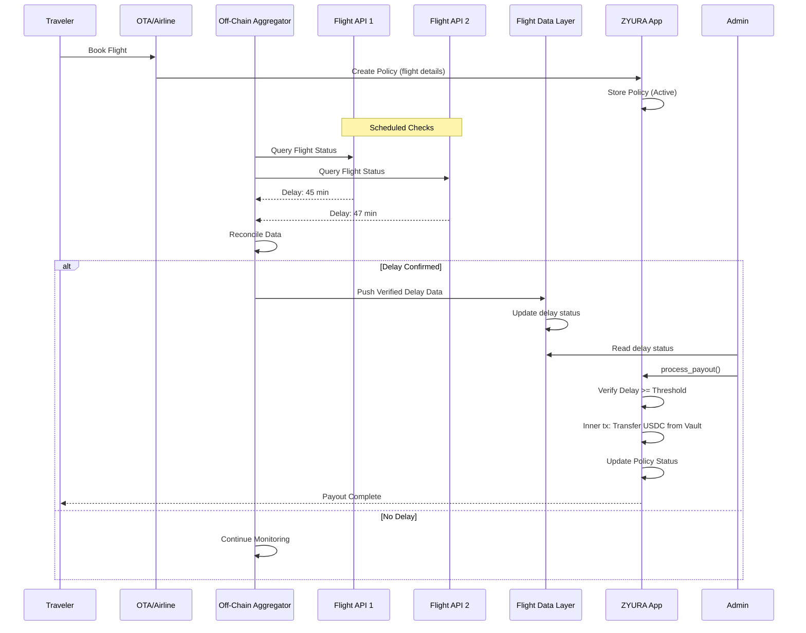

---

## Part D: User Interaction Flows

### 1. Complete User Journey: Purchase to Payout

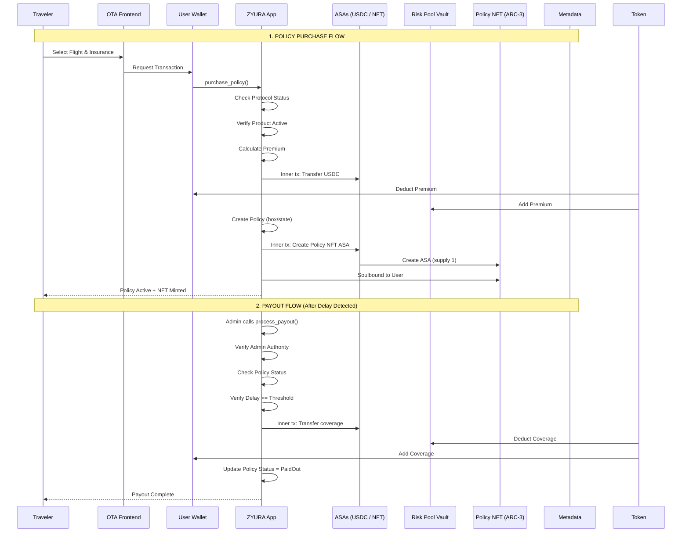

### 2. Liquidity Provider Flow

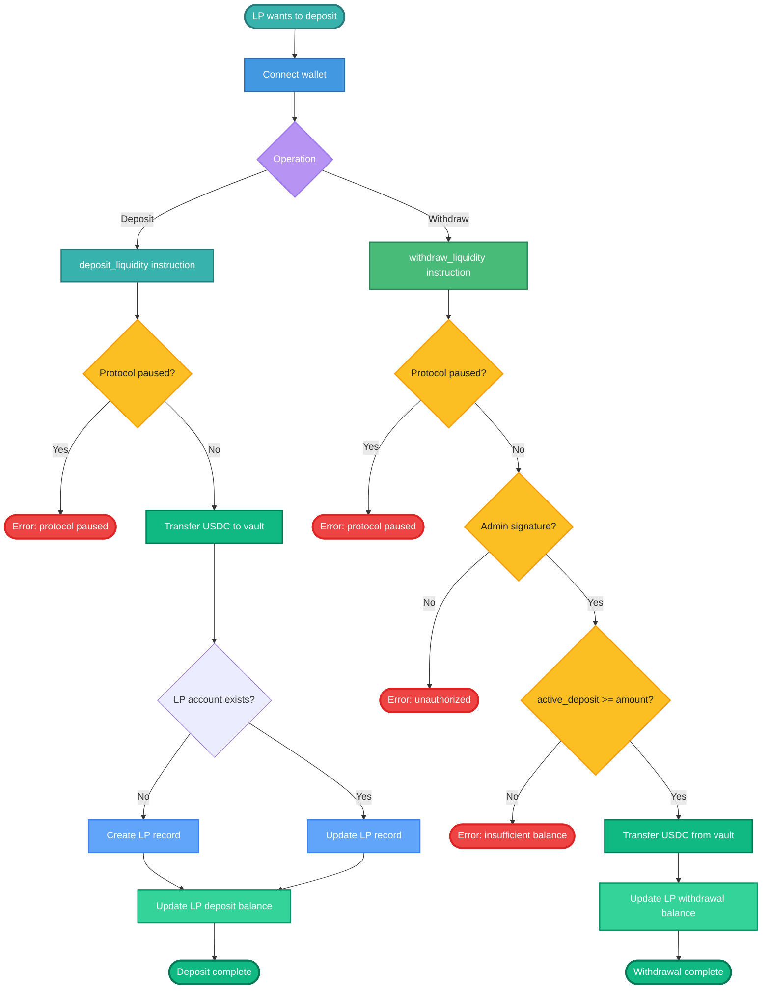

### 3. Admin Operations Flow

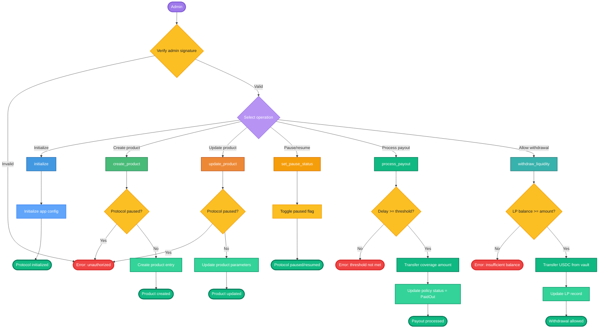

---

## Part E: Program Interaction Matrix

### 1. Inner Transactions (Algorand)

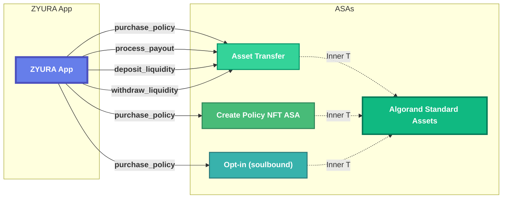

### 2. Instruction-to-Program Mapping

| ZYURA Action | Target | Inner Transaction | Purpose |
|--------------|--------|-------------------|---------|
| `purchase_policy` | USDC ASA | Asset transfer | Transfer premium to vault |
| `purchase_policy` | Policy NFT | Create ASA + opt-in | Create soulbound policy NFT (ARC-3) |
| `process_payout` | USDC ASA | Asset transfer | Transfer coverage from vault to user |
| `deposit_liquidity` | USDC ASA | Asset transfer | Transfer USDC to vault |
| `withdraw_liquidity` | USDC ASA | Asset transfer | Transfer USDC from vault |

### 3. Data Flow Between Accounts

```mermaid
graph TD
    subgraph "Policy Purchase Flow"
        USER_WALLET[User Wallet] -->|Premium USDC| VAULT[Risk Pool Vault]
        USER_WALLET -->|Create Policy| POLICY_PDA[Policy box/state]
        POLICY_PDA -->|Reference| PRODUCT_PDA[Product box]
        POLICY_PDA -->|Create NFT| NFT_MINT[Policy NFT ASA]
        NFT_MINT -->|Opt-in to User| USER_NFT[User Policy NFT]
        NFT_MINT -->|Metadata| METADATA[ARC-3 / off-chain]
    end
    
    subgraph "Payout Flow"
        ADMIN[Admin] -->|Trigger| POLICY_PDA2[Policy Account]
        POLICY_PDA2 -->|Verify Delay| PRODUCT_PDA2[Product Account]
        VAULT2[Risk Pool Vault] -->|Inner tx: Transfer| USER_WALLET2[User Wallet]
        POLICY_PDA2 -->|Update Status| STATUS[PolicyStatus = PaidOut]
    end
    
    subgraph "Liquidity Flow"
        LP_WALLET[LP Wallet] -->|Deposit USDC| VAULT3[Risk Pool Vault]
        LP_WALLET -->|Update| LP_PDA[LP box]
        LP_PDA -->|Track| BALANCE[active_deposit]
        
        ADMIN2[Admin] -->|Approve Withdrawal| LP_PDA2[LP box]
        VAULT4[Risk Pool Vault] -->|Withdraw USDC| LP_WALLET2[LP Wallet]
        LP_PDA2 -->|Update| BALANCE2[active_deposit]
    end
    
    style USER_WALLET fill:#f6ad55,stroke:#dd6b20,stroke-width:2px,color:#1a202c
    style USER_WALLET2 fill:#f6ad55,stroke:#dd6b20,stroke-width:2px,color:#1a202c
    style VAULT fill:#10b981,stroke:#047857,stroke-width:4px,color:#fff
    style VAULT2 fill:#10b981,stroke:#047857,stroke-width:4px,color:#fff
    style VAULT3 fill:#10b981,stroke:#047857,stroke-width:4px,color:#fff
    style VAULT4 fill:#10b981,stroke:#047857,stroke-width:4px,color:#fff
    style POLICY_PDA fill:#f59e0b,stroke:#d97706,stroke-width:2px,color:#fff
    style POLICY_PDA2 fill:#f59e0b,stroke:#d97706,stroke-width:2px,color:#fff
    style PRODUCT_PDA fill:#48bb78,stroke:#2f855a,stroke-width:2px,color:#fff
    style PRODUCT_PDA2 fill:#48bb78,stroke:#2f855a,stroke-width:2px,color:#fff
    style NFT_MINT fill:#a78bfa,stroke:#7c3aed,stroke-width:2px,color:#fff
    style USER_NFT fill:#fc8181,stroke:#e53e3e,stroke-width:2px,color:#fff
    style METADATA fill:#b794f4,stroke:#9f7aea,stroke-width:2px,color:#fff
    style ADMIN fill:#9f7aea,stroke:#805ad5,stroke-width:2px,color:#fff
    style ADMIN2 fill:#9f7aea,stroke:#805ad5,stroke-width:2px,color:#fff
    style STATUS fill:#fbbf24,stroke:#f59e0b,stroke-width:2px,color:#1a202c
    style LP_WALLET fill:#38b2ac,stroke:#2c7a7b,stroke-width:2px,color:#fff
    style LP_WALLET2 fill:#38b2ac,stroke:#2c7a7b,stroke-width:2px,color:#fff
    style LP_PDA fill:#60a5fa,stroke:#3b82f6,stroke-width:2px,color:#fff
    style LP_PDA2 fill:#60a5fa,stroke:#3b82f6,stroke-width:2px,color:#fff
    style BALANCE fill:#34d399,stroke:#059669,stroke-width:2px,color:#fff
    style BALANCE2 fill:#34d399,stroke:#059669,stroke-width:2px,color:#fff
```

---

## Part F: Account Management Details

### 1. Account Creation Flow

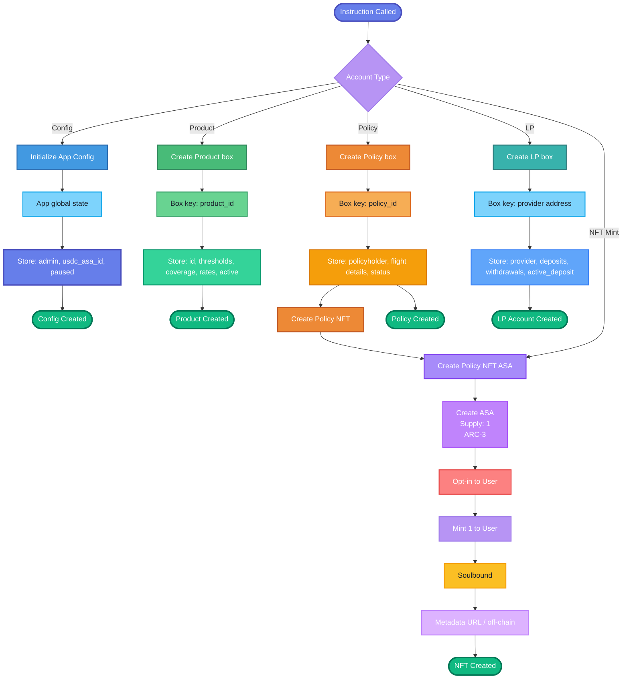

### 2. Account State Transitions

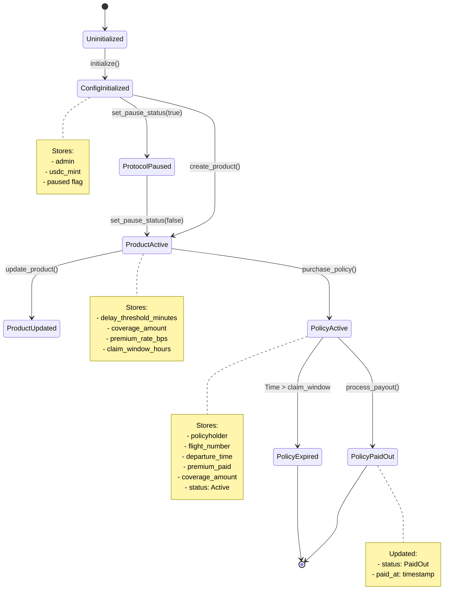

### 3. Ownership Model

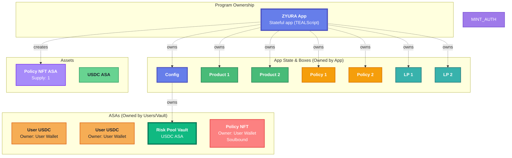

---

## Part G: Security and Access Control

### 1. Authority Checks

```mermaid
flowchart TD
    START([Instruction Call]) --> CHECK_TYPE{Instruction Type}
    
    CHECK_TYPE -->|initialize| FIRST_TIME{Config Exists?}
    FIRST_TIME -->|Yes| ERROR1([Error: Already Initialized])
    FIRST_TIME -->|No| ALLOW1([Allow: First Initialization])
    
    CHECK_TYPE -->|Admin Operations| ADMIN_CHECK{Admin Signature Valid?}
    ADMIN_CHECK -->|No| ERROR2([Error: Unauthorized])
    ADMIN_CHECK -->|Yes| CHECK_PAUSE{Protocol Paused?}
    CHECK_PAUSE -->|Yes| ALLOW_PAUSE_ONLY{Operation is Pause?}
    CHECK_PAUSE -->|No| ALLOW2([Allow: Admin Operation])
    ALLOW_PAUSE_ONLY -->|Yes| ALLOW2
    ALLOW_PAUSE_ONLY -->|No| ERROR3([Error: Protocol Paused])
    
    CHECK_TYPE -->|purchase_policy| CHECK_PAUSE2{Protocol Paused?}
    CHECK_PAUSE2 -->|Yes| ERROR4([Error: Protocol Paused])
    CHECK_PAUSE2 -->|No| CHECK_PRODUCT{Product Active?}
    CHECK_PRODUCT -->|No| ERROR5([Error: Product Inactive])
    CHECK_PRODUCT -->|Yes| CHECK_PREMIUM{Premium >= Required?}
    CHECK_PREMIUM -->|No| ERROR6([Error: Insufficient Premium])
    CHECK_PREMIUM -->|Yes| ALLOW3([Allow: Policy Purchase])
    
    CHECK_TYPE -->|process_payout| ADMIN_CHECK2{Admin Signature Valid?}
    ADMIN_CHECK2 -->|No| ERROR7([Error: Unauthorized])
    ADMIN_CHECK2 -->|Yes| CHECK_STATUS{Policy Active?}
    CHECK_STATUS -->|No| ERROR8([Error: Policy Not Active])
    CHECK_STATUS -->|Yes| CHECK_DELAY{Delay >= Threshold?}
    CHECK_DELAY -->|No| ERROR9([Error: Threshold Not Met])
    CHECK_DELAY -->|Yes| ALLOW4([Allow: Payout])
    
    CHECK_TYPE -->|deposit_liquidity| CHECK_PAUSE3{Protocol Paused?}
    CHECK_PAUSE3 -->|Yes| ERROR10([Error: Protocol Paused])
    CHECK_PAUSE3 -->|No| ALLOW5([Allow: Deposit])
    
    CHECK_TYPE -->|withdraw_liquidity| ADMIN_CHECK3{Admin Signature Valid?}
    ADMIN_CHECK3 -->|No| ERROR11([Error: Unauthorized])
    ADMIN_CHECK3 -->|Yes| CHECK_BALANCE{LP Balance >= Amount?}
    CHECK_BALANCE -->|No| ERROR12([Error: Insufficient Balance])
    CHECK_BALANCE -->|Yes| ALLOW6([Allow: Withdrawal])
    
    style START fill:#667eea,stroke:#4c51bf,stroke-width:3px,color:#fff
    style CHECK_TYPE fill:#b794f4,stroke:#9f7aea,stroke-width:2px,color:#fff
    style FIRST_TIME fill:#fbbf24,stroke:#f59e0b,stroke-width:2px,color:#1a202c
    style ADMIN_CHECK fill:#fbbf24,stroke:#f59e0b,stroke-width:2px,color:#1a202c
    style ADMIN_CHECK2 fill:#fbbf24,stroke:#f59e0b,stroke-width:2px,color:#1a202c
    style ADMIN_CHECK3 fill:#fbbf24,stroke:#f59e0b,stroke-width:2px,color:#1a202c
    style CHECK_PAUSE fill:#fbbf24,stroke:#f59e0b,stroke-width:2px,color:#1a202c
    style CHECK_PAUSE2 fill:#fbbf24,stroke:#f59e0b,stroke-width:2px,color:#1a202c
    style CHECK_PAUSE3 fill:#fbbf24,stroke:#f59e0b,stroke-width:2px,color:#1a202c
    style CHECK_PRODUCT fill:#fbbf24,stroke:#f59e0b,stroke-width:2px,color:#1a202c
    style CHECK_PREMIUM fill:#fbbf24,stroke:#f59e0b,stroke-width:2px,color:#1a202c
    style CHECK_STATUS fill:#fbbf24,stroke:#f59e0b,stroke-width:2px,color:#1a202c
    style CHECK_DELAY fill:#fbbf24,stroke:#f59e0b,stroke-width:2px,color:#1a202c
    style CHECK_BALANCE fill:#fbbf24,stroke:#f59e0b,stroke-width:2px,color:#1a202c
    style ALLOW_PAUSE_ONLY fill:#fbbf24,stroke:#f59e0b,stroke-width:2px,color:#1a202c
    style ALLOW1 fill:#10b981,stroke:#047857,stroke-width:3px,color:#fff
    style ALLOW2 fill:#10b981,stroke:#047857,stroke-width:3px,color:#fff
    style ALLOW3 fill:#10b981,stroke:#047857,stroke-width:3px,color:#fff
    style ALLOW4 fill:#10b981,stroke:#047857,stroke-width:3px,color:#fff
    style ALLOW5 fill:#10b981,stroke:#047857,stroke-width:3px,color:#fff
    style ALLOW6 fill:#10b981,stroke:#047857,stroke-width:3px,color:#fff
    style ERROR1 fill:#ef4444,stroke:#dc2626,stroke-width:3px,color:#fff
    style ERROR2 fill:#ef4444,stroke:#dc2626,stroke-width:3px,color:#fff
    style ERROR3 fill:#ef4444,stroke:#dc2626,stroke-width:3px,color:#fff
    style ERROR4 fill:#ef4444,stroke:#dc2626,stroke-width:3px,color:#fff
    style ERROR5 fill:#ef4444,stroke:#dc2626,stroke-width:3px,color:#fff
    style ERROR6 fill:#ef4444,stroke:#dc2626,stroke-width:3px,color:#fff
    style ERROR7 fill:#ef4444,stroke:#dc2626,stroke-width:3px,color:#fff
    style ERROR8 fill:#ef4444,stroke:#dc2626,stroke-width:3px,color:#fff
    style ERROR9 fill:#ef4444,stroke:#dc2626,stroke-width:3px,color:#fff
    style ERROR10 fill:#ef4444,stroke:#dc2626,stroke-width:3px,color:#fff
    style ERROR11 fill:#ef4444,stroke:#dc2626,stroke-width:3px,color:#fff
    style ERROR12 fill:#ef4444,stroke:#dc2626,stroke-width:3px,color:#fff
```

### 2. Error Handling Matrix

| Error Condition | Instruction | Error Code | Recovery Path |
|----------------|-------------|------------|---------------|
| Protocol Paused | purchase_policy, deposit_liquidity | ProtocolPaused | Admin must unpause |
| Product Inactive | purchase_policy | ProductInactive | Admin must activate product |
| Insufficient Premium | purchase_policy | InsufficientPremium | User must increase premium |
| Unauthorized | Admin operations | Unauthorized | Verify admin keypair |
| Policy Not Active | process_payout | PolicyNotActive | Policy already paid/expired |
| Delay Threshold Not Met | process_payout | DelayThresholdNotMet | Delay insufficient for payout |
| Insufficient Balance | withdraw_liquidity | InvalidAmount | LP must reduce amount |

---

## Part H: Summary and Key Design Decisions

### 1. Architecture Highlights

**Program Structure:**
- Single stateful app (TEALScript) for simplicity in POC
- Modular logic (initialize, products, policies, liquidity, admin) for clear separation
- App state and box storage for deterministic, scalable state

**Account Design:**
- Config in app global state; products, policies, LPs in boxes keyed by id/address
- Config as central authority store
- Product boxes enable multiple insurance products
- Policy boxes store individual policy state
- LP boxes track per-provider liquidity positions

**Security Model:**
- Admin-controlled critical operations (payouts, withdrawals)
- Protocol-level pause mechanism for emergencies
- Product-level activation controls
- Soulbound policy NFTs (ARC-3) for non-transferable proof

**External Integration:**
- Flight data layer for delay/PNR verification
- ARC-3 and off-chain metadata for policy NFTs
- Algorand Standard Assets for USDC and policy NFTs

### 2. Scalability Considerations

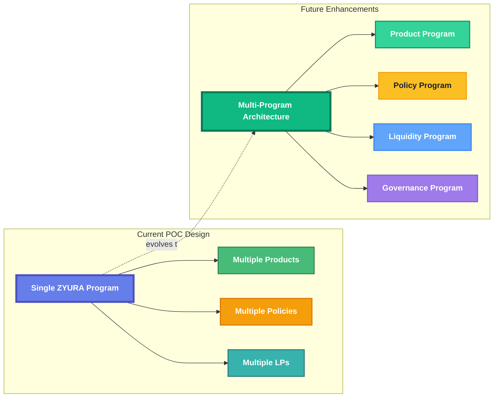

### 3. Design Rationale

1. **App State & Box Storage:** Protocol state uses app global state and boxes for:
   - Deterministic keys (e.g. product_id, policy_id, provider address)
   - App ownership guarantees
   - Scalable policy and product storage

2. **NFT as Policy Proof:** Policy NFTs serve as:
   - Immutable proof of insurance purchase
   - Non-transferable (frozen) to prevent policy trading
   - Metadata storage for policy details

3. **Admin-Controlled Payouts:** Payouts require admin signature to:
   - Enable oracle verification before on-chain execution
   - Allow manual review of edge cases
   - Prevent automated abuse in POC phase

4. **Single Vault Design:** One risk pool vault for:
   - Simplified liquidity management
   - Easier accounting and auditing
   - Clear separation of protocol funds

---

## Appendix: Diagram Legend

### Shapes and Colors

- **Blue Boxes (#4a90e2):** ZYURA Program and core accounts
- **Light Blue (#90cdf4):** Instruction modules
- **Green (#10b981):** Token/vault accounts and successful operations
- **Yellow (#fbbf24):** Policy accounts and oracle systems
- **Purple (#a78bfa):** NFT-related accounts
- **Orange (#ed8936):** External services
- **Red (#f56565):** Errors and rejected operations

### Arrow Types

- **Solid Arrows:** Direct calls/transfers
- **Dashed Arrows:** Inner transactions (Algorand)
- **Dotted Arrows:** Data reads/references

### Account Types

- **App state / boxes:** Config, products, policies, LPs (owned by ZYURA App)
- **ASAs:** Algorand Standard Assets (USDC, policy NFT)
- **Policy NFT:** ARC-3 ASA, soulbound; metadata via URL or off-chain

---

**End of Assignment 3: Architecture Design**

